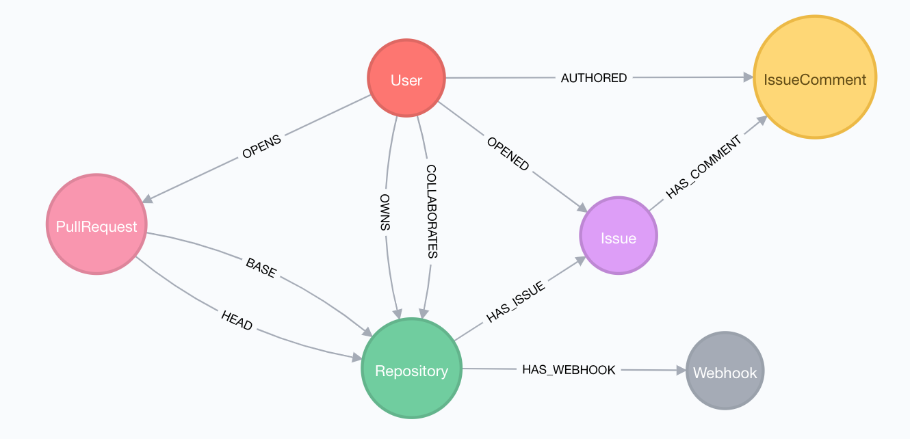
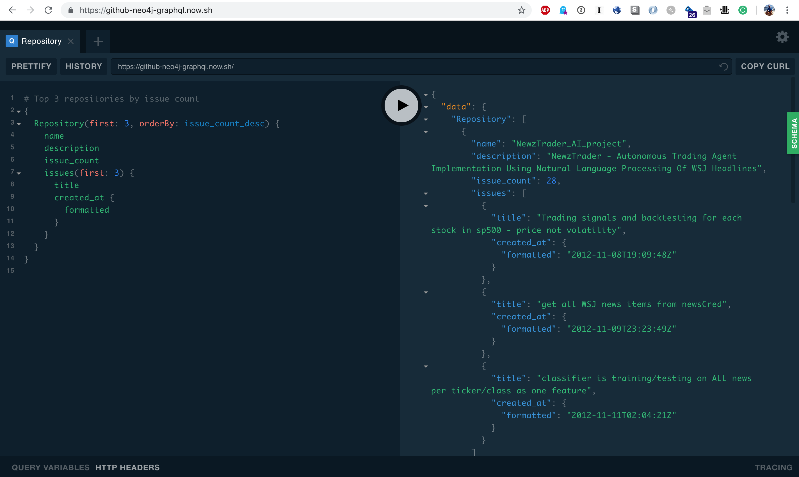

# GitHub GraphQL Neo4j

Working with exported GitHub data in Neo4j and GraphQL.

## [`/import`](import/)

Import script for loading exported GitHub data into Neo4j

## [`/api`](api/)

Create a GraphQL API backed by Neo4j using [neo4j-graphql.js](https://grandstack.io/docs/neo4j-graphql-js.html) and [GRANDstack](https://grandstack.io/)